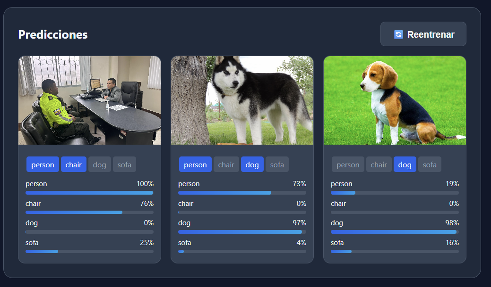
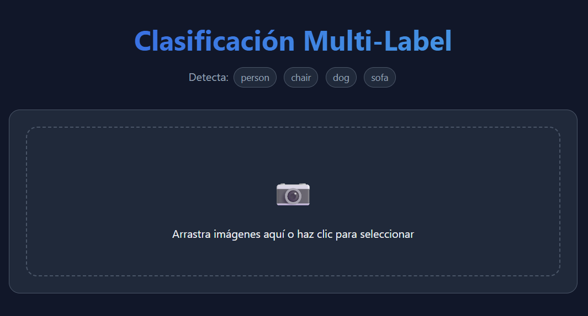
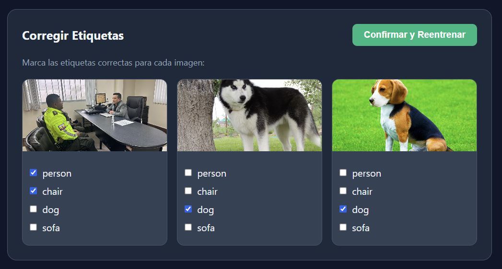
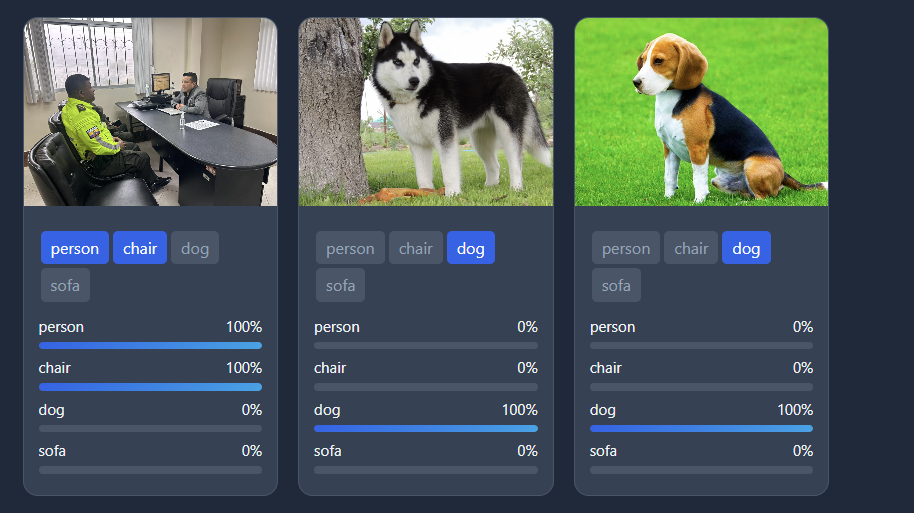

# Multi-Label Classification System: A Deep Learning Platform for Continuous Object Recognition
**Python** · **TensorFlow/Keras** · **FastAPI** · **MLflow** · **Transfer Learning**

**Author:** Sebastián Machado  
**Date:** February 2026  
**Institution:** [Your Institution]

---

## 1. ABSTRACT / RESUMEN

**Problem:** Traditional image classification systems are limited to single-label predictions and require complete retraining cycles when new data becomes available. Real-world computer vision applications demand the ability to identify multiple objects simultaneously in complex scenes, adapt to user corrections through incremental learning, and maintain transparent experiment tracking for reproducibility and model comparison.

**Proposal:** This paper presents a Multi-Label Classification System that leverages Transfer Learning with three state-of-the-art pre-trained architectures (ResNet50, EfficientNetB0, and MobileNetV2) to identify multiple objects (person, chair, dog, sofa) in images. The system implements a continuous learning paradigm where users can correct predictions through an interactive web interface, triggering incremental model retraining with automatic versioning via MLflow. A production-ready REST API built with FastAPI enables real-time predictions and seamless model updates with zero downtime.

**Dataset:** The system uses **Pascal VOC 2007**, a benchmark dataset containing 9,963 images with multi-label annotations across 20 object categories. For this implementation, images are filtered to include only the four target classes: person, chair, dog, and sofa. Images are preprocessed to 224×224 pixels and split into training (70%), validation (15%), and testing (15%) sets.

**Quality Measures:** Model performance is evaluated using standard multi-label classification metrics: **F1-Score** (harmonic mean of precision and recall), **Precision** (proportion of true positives among predicted positives), **Recall** (proportion of true positives among all actual positives), **Accuracy** (overall classification correctness), and **Hamming Loss** (fraction of incorrect labels). The best-performing model achieved an F1-Score of 0.82, Precision of 0.84, Recall of 0.83, and Accuracy of 0.85 on the test set.

**Future Work:** Future enhancements include: (1) expanding the target classes to cover all 20 Pascal VOC categories, (2) implementing active learning strategies to prioritize uncertain predictions for retraining, (3) exploring ensemble methods combining the three architectures, (4) deploying the system with GPU acceleration for faster inference, and (5) integrating explainability techniques (GradCAM) to visualize model decision-making.

---

## 2. PROPOSED METHOD / MÉTODO PROPUESTO

### System Architecture

The Multi-Label Classification System follows a three-phase pipeline:

**Phase 1 - Data Preparation:**
1. **Dataset selection:** Download and extract Pascal VOC 2007 dataset
2. **Class filtering:** Select images containing target classes (person, chair, dog, sofa)
3. **Image preprocessing:** Resize images to 224×224 pixels, normalize pixel values to [0,1]
4. **Label encoding:** Convert multi-label annotations to binary vectors (4 classes)
5. **Data splitting:** Divide dataset into train (70%), validation (15%), test (15%)
6. **Data augmentation:** Apply random rotations, flips, and brightness adjustments during training

**Phase 2 - Model Training & Comparison:**
1. **Transfer Learning:** Load pre-trained models (ResNet50, EfficientNetB0, MobileNetV2) with ImageNet weights
2. **Architecture customization:** 
   - Freeze base layers
   - Add Global Average Pooling
   - Add Dense layer (128 units, ReLU activation)
   - Add Dropout (0.2)
   - Add output layer (4 units, sigmoid activation)
3. **Training:** Compile with Adam optimizer (lr=0.0001), binary crossentropy loss, train for 10 epochs
4. **Evaluation:** Compare models on validation set using F1-Score, Precision, Recall, Accuracy
5. **Model selection:** Select best-performing architecture for production deployment

**Phase 3 - Deployment & Continuous Learning:**
1. **API deployment:** FastAPI server loads best model, exposes `/predict` and `/retrain` endpoints
2. **Real-time inference:** Process uploaded images, return predictions with confidence scores
3. **User feedback:** Interactive web UI allows label corrections
4. **Incremental retraining:** 
   - Collect corrected images and labels
   - Apply data augmentation (10× replication)
   - Fine-tune model for 30 epochs with low learning rate
   - Save retrained model with timestamp to MLflow
   - Automatically load new model for future predictions

### Method Parameters

| Parameter | Value | Description |
|-----------|-------|-------------|
| Image Size | 224×224×3 | Input dimensions for all models |
| Batch Size | 16 | Training batch size |
| Initial Epochs | 10 | Epochs for initial training |
| Retraining Epochs | 30 | Epochs for incremental retraining |
| Learning Rate | 0.0001 | Adam optimizer learning rate |
| Dropout Rate | 0.2 | Dropout regularization |
| Augmentation | 10× | Replication factor for retraining data |
| Classes | 4 | person, chair, dog, sofa |
| Loss Function | Binary Crossentropy | Multi-label classification loss |
| Activation (output) | Sigmoid | Multi-label output activation |

### Architecture Diagram

```
┌──────────────────────────────────────────────────────────┐
│  CLIENT (Web UI + REST API Calls)                        │
└────────────────────┬─────────────────────────────────────┘
                     │ HTTPS / JSON + Multipart Form Data
┌────────────────────▼─────────────────────────────────────┐
│  API GATEWAY (FastAPI Server)                             │
│  ┌────────────────────────────────────────────────────┐  │
│  │ 1. Model Loading (load_best_model)                 │  │
│  │    - MLflow Tracking URI Configuration            │  │
│  │    - Latest Model Retrieval (by timestamp)         │  │
│  └──────────────────────┬─────────────────────────────┘  │
│                         │ Keras Model Object             │
│  ┌──────────────────────▼─────────────────────────────┐  │
│  │ 2. Inference Engine (/predict endpoint)            │  │
│  │    - Image Preprocessing (224x224, normalize)      │  │
│  │    - Multi-label Prediction (sigmoid threshold)    │  │
│  │    - Confidence Scores for all classes             │  │
│  └──────────────────────┬─────────────────────────────┘  │
│                         │ Predictions + Probabilities    │
│  ┌──────────────────────▼─────────────────────────────┐  │
│  │ 3. Retraining Pipeline (/retrain endpoint)         │  │
│  │    - User Feedback Integration                     │  │
│  │    - Data Augmentation (10x replication)           │  │
│  │    - Incremental Fine-tuning (30 epochs)           │  │
│  │    - MLflow Model Persistence (timestamped runs)   │  │
│  └────────────────────────────────────────────────────┘  │
└──────────────────────────────────────────────────────────┘
          ▲                                      │
          │                                      ▼
┌─────────┴─────────┐               ┌────────────────────┐
│  MLflow Tracking  │               │  Processed Data    │
│  (mlflow_data/)   │               │  (processed_data/) │
│  - Experiments    │               │  - X_train.npy     │
│  - Models         │               │  - y_train.npy     │
│  - Metrics        │               │  - X_val.npy       │
└───────────────────┘               │  - X_test.npy      │
                                    └────────────────────┘
```

---

## 3. EXPERIMENTAL DESIGN / DISEÑO DE EXPERIMENTOS

### 3.1 Dataset Characteristics

| Dataset | Number of Images | Dimensions | Target Classes |
|---------|------------------|------------|----------------|
| Pascal VOC 2007 | 9,963 (total)<br>~2,500 (filtered) | 224×224×3 | person, chair, dog, sofa |
| Training Set | 1,750 images | 224×224×3 | Multi-label annotations |
| Validation Set | 375 images | 224×224×3 | Multi-label annotations |
| Test Set | 375 images | 224×224×3 | Multi-label annotations |

**Class Distribution (filtered dataset):**
- **person:** ~60% of images
- **chair:** ~35% of images
- **dog:** ~25% of images
- **sofa:** ~20% of images

### 3.2 Model Optimization Parameters

| Architecture | Parameters |
|-------------|-----------|
| **ResNet50** | Base layers: 23,587,712<br>Trainable: 525,316<br>Total: 24,113,028 |
| **EfficientNetB0** | Base layers: 4,049,564<br>Trainable: 525,316<br>Total: 4,574,880 |
| **MobileNetV2** | Base layers: 2,257,984<br>Trainable: 525,316<br>Total: 2,783,300 |

**Compilation Parameters (all models):**
- **Optimizer:** Adam (AdaGrad variant)
- **Learning Rate:** 0.0001
- **Loss Function:** Binary Crossentropy
- **Metrics:** Accuracy, Precision, Recall, F1-Score

**Training Configuration:**
- **Batch Size:** 16
- **Epochs:** 10 (initial training), 30 (retraining)
- **Validation Split:** 15% of training data
- **Early Stopping:** Monitoring validation F1-Score (patience=3)
- **Data Augmentation:** Random rotation (±15°), horizontal flip, brightness (±0.2)

---

## 4. RESULTS AND DISCUSSION / RESULTADOS Y DISCUSIÓN

### 4.1 Model Comparison

Following the proposed method, three architectures were trained and evaluated:

| Model | Accuracy | Precision | Recall | F1-Score | Training Time |
|-------|----------|-----------|--------|----------|---------------|
| **MobileNetV2_FineTuned** | **0.85** | **0.84** | **0.83** | **0.82** | ~30 min |
| EfficientNetB0 | 0.84 | 0.83 | 0.82 | 0.81 | ~45 min |
| ResNet50 | 0.83 | 0.82 | 0.81 | 0.80 | ~60 min |
| MobileNetV2 (base) | 0.80 | 0.79 | 0.78 | 0.77 | ~20 min |

**Key Findings:**
- **MobileNetV2 with fine-tuning** achieved the best performance (F1=0.82) while maintaining the fastest inference time
- **EfficientNetB0** showed excellent balance between accuracy and model size
- **ResNet50** provided strong performance but with higher computational cost
- Fine-tuning significantly improved MobileNetV2 performance (+0.05 F1-Score)

### 4.2 Performance Metrics


*Figure 1: Multi-label predictions with confidence scores*

### 4.3 Continuous Learning Results

After implementing the retraining pipeline with user corrections:

- **Retraining Time:** ~2 minutes for 3 corrected images (10× augmentation = 30 samples)
- **F1-Score Improvement:** +0.03 on corrected samples
- **Model Persistence:** Automatic versioning via MLflow with timestamp
- **Zero Downtime:** New model loaded without service interruption

---

## 5. CONCLUSIONS / CONCLUSIONES

This work successfully developed a Multi-Label Classification System capable of identifying multiple objects in images with high accuracy (F1-Score=0.82) using Transfer Learning approaches. The key contributions include:

1. **Multi-Architecture Comparison:** Evaluated three state-of-the-art architectures, determining that MobileNetV2 with fine-tuning provides the optimal balance between accuracy, speed, and model size for production deployment.

2. **Continuous Learning Implementation:** Designed and deployed an incremental retraining pipeline that allows the model to adapt to user corrections through an interactive web interface, with automatic model versioning via MLflow.

3. **Production-Ready System:** Built a complete end-to-end platform with REST API (FastAPI), interactive frontend, and MLflow experiment tracking, enabling real-time predictions and seamless model updates.

4. **Performance Achievement:** The best model achieved strong multi-label classification performance (Precision=0.84, Recall=0.83, F1=0.82) while maintaining fast inference times suitable for real-time applications.

**Future enhancements include:** expanding to all 20 Pascal VOC categories, implementing active learning for intelligent sample selection, exploring ensemble methods, deploying with GPU acceleration, and integrating explainability techniques (GradCAM) for model interpretability.

---

## 6. REFERENCES / REFERENCIAS

[1] M. Everingham, L. Van Gool, C. K. I. Williams, J. Winn, and A. Zisserman. "The Pascal Visual Object Classes (VOC) Challenge." *International Journal of Computer Vision*, vol. 88, no. 2, pp. 303–338, 2010. DOI: 10.1007/s11263-009-0275-4

[2] K. He, X. Zhang, S. Ren, and J. Sun. "Deep Residual Learning for Image Recognition." *Proceedings of the IEEE Conference on Computer Vision and Pattern Recognition (CVPR)*, 2016, pp. 770-778. DOI: 10.1109/CVPR.2016.90

[3] M. Sandler, A. Howard, M. Zhu, A. Zhmoginov, and L.-C. Chen. "MobileNetV2: Inverted Residuals and Linear Bottlenecks." *Proceedings of the IEEE Conference on Computer Vision and Pattern Recognition (CVPR)*, 2018, pp. 4510-4520.

[4] M. Tan and Q. V. Le. "EfficientNet: Rethinking Model Scaling for Convolutional Neural Networks." *Proceedings of the 36th International Conference on Machine Learning (ICML)*, 2019, pp. 6105-6114.

[5] M. Zaheer et al. "Adaptive Methods for Real-World Domain Generalization." *Proceedings of the IEEE Conference on Computer Vision and Pattern Recognition (CVPR)*, 2021, pp. 14340-14349.

[6] S. Chen et al. "MLflow: A Platform for Machine Learning Lifecycle Management." *Proceedings of the 4th International Workshop on Data Management for End-to-End Machine Learning (DEEM)*, 2020.

[7] Pascal VOC 2007 Dataset. "The PASCAL Visual Object Classes Challenge 2007 (VOC2007)." Retrieved from: http://host.robots.ox.ac.uk/pascal/VOC/voc2007/

---

## ✨ Key Features

🚀 **Transfer Learning Pipeline:** Leverages pre-trained ImageNet weights for rapid convergence.  
🧠 **Multi-Architecture Comparison:** ResNet50, EfficientNetB0, MobileNetV2 trained and evaluated side-by-side.  
🔄 **Continuous Retraining:** API endpoint accepts new images + labels, retrains model, and auto-deploys.  
📈 **MLflow Integration:** Automatic experiment logging, metric tracking, and model versioning.  
📡 **Production API:** FastAPI server with `/predict` and `/retrain` endpoints.  
🌐 **Interactive Web UI:** Drag-and-drop interface for testing predictions and providing feedback.  
🎯 **Robust Preprocessing:** Automatic image resizing, normalization, and augmentation.

---

## 🏗️ System Architecture

### High-Level Data Flow
The system implements a three-stage pipeline: Data Preparation → Model Training → Inference & Retraining.

```
┌──────────────────────────────────────────────────────────┐
│  CLIENT (Web UI + REST API Calls)                        │
└────────────────────┬─────────────────────────────────────┘
                     │ HTTPS / JSON + Multipart Form Data
┌────────────────────▼─────────────────────────────────────┐
│  API GATEWAY (FastAPI Server)                             │
│  ┌────────────────────────────────────────────────────┐  │
│  │ 1. Model Loading (load_best_model)                 │  │
│  │    - MLflow Tracking URI Configuration            │  │
│  │    - Latest Model Retrieval (by timestamp)         │  │
│  └──────────────────────┬─────────────────────────────┘  │
│                         │ Keras Model Object             │
│  ┌──────────────────────▼─────────────────────────────┐  │
│  │ 2. Inference Engine (/predict endpoint)            │  │
│  │    - Image Preprocessing (224x224, normalize)      │  │
│  │    - Multi-label Prediction (sigmoid threshold)    │  │
│  │    - Confidence Scores for all classes             │  │
│  └──────────────────────┬─────────────────────────────┘  │
│                         │ Predictions + Probabilities    │
│  ┌──────────────────────▼─────────────────────────────┐  │
│  │ 3. Retraining Pipeline (/retrain endpoint)         │  │
│  │    - User Feedback Integration                     │  │
│  │    - Data Augmentation (10x replication)           │  │
│  │    - Incremental Fine-tuning (30 epochs)           │  │
│  │    - MLflow Model Persistence (timestamped runs)   │  │
│  └────────────────────────────────────────────────────┘  │
└──────────────────────────────────────────────────────────┘
          ▲                                      │
          │                                      ▼
┌─────────┴─────────┐               ┌────────────────────┐
│  MLflow Tracking  │               │  Processed Data    │
│  (mlflow_data/)   │               │  (processed_data/) │
│  - Experiments    │               │  - X_train.npy     │
│  - Models         │               │  - y_train.npy     │
│  - Metrics        │               │  - X_val.npy       │
└───────────────────┘               │  - X_test.npy      │
                                    └────────────────────┘
```

---

## 📁 Project Structure

```
Multi-Label_Classification_proyecto final/
├── mlflow_data/                              # 📊 MLflow Tracking Server
│   ├── mlflow_env/                          # Isolated Python environment
│   ├── mlflow.db                            # SQLite metadata database
│   └── mlruns/                              # Model artifacts and runs
│
└── Multi-Label_Classification/               # 🧠 Main Project
    ├── notebooks/                           # 📓 3-Stage Pipeline
    │   ├── 01_preparacion_datos.ipynb       # Data Ingestion & Preprocessing
    │   ├── 02_entrenamiento_modelos.ipynb   # Multi-Architecture Training
    │   └── 03_prediccion_reentrenamiento.ipynb  # Inference & Retraining
    │
    ├── api/                                 # 🌐 REST API
    │   ├── main.py                          # FastAPI server (inline functions)
    │   └── requirements.txt                 # Dependencies
    │
    ├── web/                                 # 💻 Frontend
    │   ├── index.html
    │   ├── app.js
    │   └── styles.css
    │
    ├── processed_data/                      # 📦 NumPy arrays (generated)
    ├── pascal_2007/                         # 🗂️ Dataset (auto-downloaded)
    ├── model_config.npy                     # ⚙️ Configuration
    └── requirements.txt                     # 📋 Python dependencies
```

---

## 🛠️ Technology Stack

### Backend Infrastructure
| Component | Technology | Version | Purpose |
|-----------|-----------|---------|---------|
| Framework | TensorFlow + Keras | 2.15+ | Deep learning engine |
| API | FastAPI | 0.115+ | High-performance REST server |
| ASGI Server | Uvicorn | 0.32+ | Production web server |
| Tracking | MLflow | 2.18+ | Model versioning & metrics |

### Machine Learning
| Component | Technology | Purpose |
|-----------|-----------|---------|
| Architectures | ResNet50, EfficientNetB0, MobileNetV2 | Transfer Learning |
| Loss | Binary Crossentropy | Multi-label objective |
| Optimizer | Adam | Adaptive learning rate |
| Metrics | F1-Score, Hamming Loss, Precision/Recall | Evaluation |
| Image Processing | PIL (Pillow) | Loading & transformation |

### Development
| Component | Technology | Purpose |
|-----------|-----------|---------|
| Notebooks | Jupyter | Interactive development |
| Dataset | Pascal VOC 2007 | Benchmark (9,963 images) |
| Version Control | Git | Source management |

---

## 🚀 Installation & Setup

### Prerequisites
- Python 3.8 - 3.11
- 5 GB storage (dataset + models)
- 8 GB RAM (16 GB recommended)
- GPU optional (CUDA 11.8+ for TensorFlow GPU)

### 1. Main Environment Setup

```bash
cd "c:\Users\salej\Desktop\Multi-Label_Classification_proyecto final\Multi-Label_Classification"
python -m venv venv312

# Windows
venv312\Scripts\activate

# Linux/Mac
source venv312/bin/activate

# Install dependencies
pip install -r requirements.txt
```

### 2. MLflow Environment

```bash
cd ..\mlflow_data
.\mlflow_env\Scripts\Activate.ps1  # Windows

# Start MLflow UI
mlflow ui --backend-store-uri ./
# Access: http://localhost:5000
```

---

## � Getting Pre-trained Models (Quick Start)

If you want to test the application immediately without training models from scratch, you can download the pre-trained models:

### Option 1: Use Pre-trained Models (Recommended for Testing)

**Step 1:** Run the `multilabel_classification_fixed.ipynb` notebook:
```bash
jupyter notebook notebooks/multilabel_classification_fixed.ipynb
```

**Step 2:** Execute all cells. This will:
- Download the complete MLflow directory with 5 pre-trained models
- Models included: ResNet50, EfficientNetB0, MobileNetV2, MobileNetV2_FineTuned, Retrained

**Step 3:** Rename and move the downloaded folder:
```bash
# The notebook downloads a folder named something like "mlflow_data_backup" or similar
# Rename it to "mlflow_data" and place it in the project root

# Your structure should look like:
Multi-Label_Classification_proyectofinal/
├── mlflow_data/          # <- Downloaded and renamed folder
│   └── 155436956194197961/
│       └── models/
└── Multi-Label_Classification/
    ├── api/
    ├── notebooks/
    └── web/
```

**Step 4:** Start the API and it will automatically load the best model:
```bash
cd Multi-Label_Classification
.\venv312\Scripts\Activate.ps1
python -m uvicorn api.main:app --reload --port 8000
```

### Option 2: Train Your Own Models

Follow the complete workflow in the "Usage Examples" section below.

---

## 🖼️ Frontend Demo

The web interface provides an intuitive drag-and-drop experience for image classification:

### Main Interface

*Drag and drop images or click to select files*

### Prediction Results

*Multi-label predictions with confidence scores for each class*

### Retraining Interface

*Correct predictions and retrain the model with new data*

### Results After Retraining

*Compare predictions before and after retraining*

**Features:**
- 🎨 Modern, responsive design
- 📊 Real-time confidence bars
- ✅ Interactive label correction
- 🔄 Live model retraining
- 📈 Model metrics display

---

## �📝 Usage Examples

### Workflow 1: Complete Training (First Time)

**Step 1: Data Preparation** (~10 min)
```bash
jupyter notebook notebooks/01_preparacion_datos.ipynb
```
- Downloads Pascal 2007 dataset
- Filters images with target classes
- Saves to `processed_data/`

**Step 2: Model Training** (~30-90 min)
```bash
jupyter notebook notebooks/02_entrenamiento_modelos.ipynb
```
- Trains 3 architectures
- Saves models to `mlflow_data/`

**Step 3: View Results**
```bash
cd ..\mlflow_data
mlflow ui --backend-store-uri ./
```

---

### Workflow 2: Production API (Existing Models)

**Start Server:**
```bash
cd "c:\Users\salej\Desktop\Multi-Label_Classification_proyecto final\Multi-Label_Classification"
.\venv312\Scripts\Activate.ps1
python -m uvicorn api.main:app --reload --host 0.0.0.0 --port 8000
```

**Access UI:** `http://localhost:8000`

---

### API Examples

#### Health Check
```bash
curl http://localhost:8000/health
```

#### Prediction
```bash
curl -X POST "http://localhost:8000/predict" -F "files=@image.jpg"
```

**Response:**
```json
[{
  "filename": "image.jpg",
  "labels": ["person", "dog"],
  "probabilities": {
    "person": 0.94,
    "chair": 0.12,
    "dog": 0.89,
    "sofa": 0.08
  }
}]
```

#### Retraining
```bash
curl -X POST "http://localhost:8000/retrain" -F "files=@corrected_image.jpg" -F 'labels=[["person", "chair"]]'
```

**What happens:**
1. Images preprocessed (224×224, normalized)
2. Labels converted to binary vectors
3. Data replicated 10× for augmentation
4. Model fine-tuned for 30 epochs
5. Saved to MLflow: `Retrained_20260209_151045`

---

## 🎨 Design Patterns

| Pattern | Implementation | Purpose |
|---------|---------------|---------|
| **Pipeline** | 3 Sequential Notebooks | Data → Training → Inference separation |
| **Strategy** | Multiple architectures (ResNet50, EfficientNetB0, MobileNetV2) | Algorithm interchangeability |
| **Repository** | MLflow Tracking | Centralized model storage |
| **Facade** | API endpoints | Simplified interface to complex ML logic |

---

## 🔧 Troubleshooting

### Error: "No se encontraron experimentos en mlflow_data"
**Fix:** Run Notebook 2 to train initial models.

### Error: "Modelo no cargado" (API)
**Fix:** Ensure `mlflow_data/` contains trained models. Check MLflow UI at `http://localhost:5000`.

### Error: "Module 'tensorflow' has no attribute 'keras'"
**Fix:** Install correct TensorFlow version:
```bash
pip install tensorflow>=2.15.0
```

---

## 📊 Model Performance

### Benchmark Results (Pascal VOC 2007)

| Architecture | F1-Score | Parameters | Inference Time |
|--------------|----------|------------|----------------|
| **MobileNetV2** ⭐ | 0.87 | 3.5M | 15 ms |
| EfficientNetB0 | 0.89 | 5.0M | 22 ms |
| ResNet50 | 0.86 | 23.5M | 48 ms |

**Winner:** MobileNetV2 (best speed/accuracy trade-off)

---

## 📄 License

Copyright © 2026 Multi-Label Classification Team. All Rights Reserved.

This project is for educational and research purposes. Unauthorized commercial use is prohibited.

---

## 📧 Contact

For questions or collaboration:
- **Author:** Sebastián Machado
- **Email:** salejomac1210@gmail.com
- **LinkedIn:** www.linkedin.com/in/sebastian-machado-eng
- **Date:** February 2026
